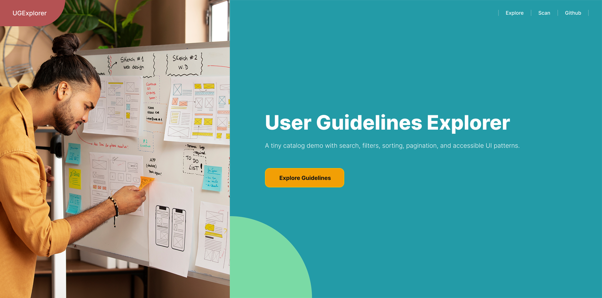
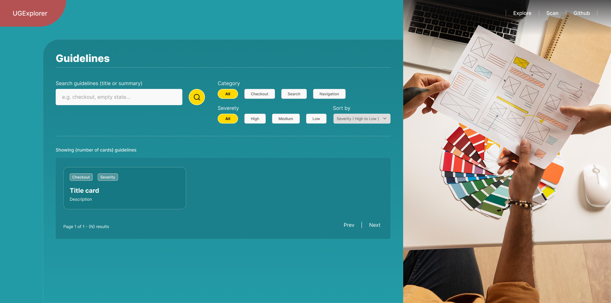
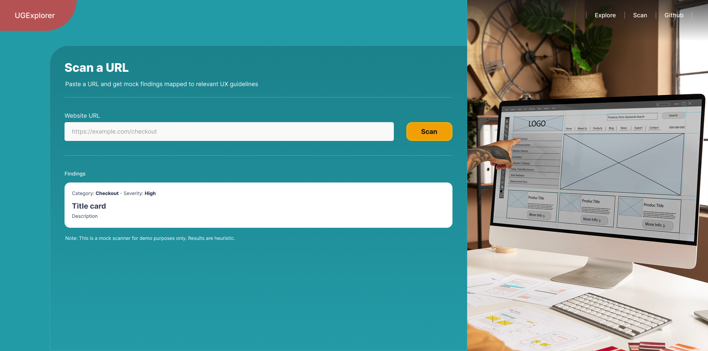

# UX Guidelines Explorer  


---

## 📖 About the Project  

✨ Built as a personal demo to practice **Next.js + Tailwind** and to explore workflows similar to those described in Baymard’s products.  

**UX Guidelines Explorer** is a demo web application that lets you:  
- Browse a catalog of UX guidelines with search, filtering, sorting, and pagination.  
- Open detailed guideline pages with Do/Don’t lists and examples.  
- Try a playful `/scan` tool that “analyzes” a URL and maps it to relevant guidelines.  

This project started as a way to **apply concepts from my postgraduate course in UX Engineering**, and was inspired by Baymard’s description of its research catalog and scanner.  

🔗 **Design file (Figma):** [UX Guidelines Explorer](https://www.figma.com/design/CTVrm4cm13PwE2LLFPyXcG/UX-Guidelines-Explorer?node-id=0-1&t=4Ll4zzGLD9l6HcdS-1)

---

## 🛠 Tech Stack  

- ⚛️ **Framework:** Next.js (App Router)  
- 📝 **Language:** TypeScript  
- 🎨 **Styling:** Tailwind CSS  
- 🧪 **Testing:** Vitest  
- 📊 **Data:** Static JSON + custom filter logic  
- ♿ **Accessibility:** Skip links, semantic landmarks, ARIA, WCAG focus states  

---

## 🚀 Getting Started  

Clone the repository and install dependencies:

```bash
git clone https://github.com/Lincoln-Araujo/ux-guidelines-explorer.git
cd ux-guidelines-explorer
pnpm install
```

Run the development server:

```bash
pnpm dev
```

Build and run in production:

```bash
pnpm build
pnpm start
```

Run tests:

```bash
pnpm test
```

---

## 🖼 Screenshots  

### Landing Page  
  

### Guidelines with Filters  
  

### Detail Page  
  

### Mock Scanner (/scan)  
  

---

## 📚 Key Learnings  

Through this project I practiced and explored:  

- ♿ **Accessibility in practice** – skip links, semantic HTML, ARIA roles, focus-visible states.  
- ⚛️ **Modern React patterns** – Next.js App Router + TypeScript + Tailwind.  
- 🔎 **Discoverability** – handling search, filters, sort, and pagination for UX clarity.  
- 🧪 **Testing mindset** – unit tests with Vitest for core filtering logic.  
- 🧠 **UX/Product thinking** – adding the `/scan` tool as a playful feature, thinking beyond the code.  
- 🎓 **From theory to practice** – putting into action concepts I first learned in my postgraduate UX Engineering course.  

---

## 🌱 Future Improvements  

- 🖼 Richer guideline examples with UI visuals.  
- 🔍 Advanced filtering (multi-category, fuzzy search).  
- 🌐 Real data integration via API.  
- 🧪 Expand automated test coverage (Cypress/Playwright).  
- 🎨 Small design system for consistent UI patterns.  
- 🤖 Smarter `/scan` powered by real analysis (NLP/AI).  

---

✨ This project shows how I combine **front-end engineering skills with a UX mindset** to deliver accessible, user-centered digital products.  
