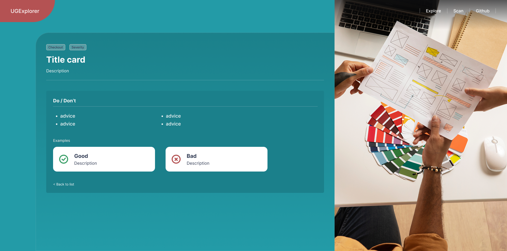

# UX Guidelines Explorer

---

## Introduction  

Welcome to my portfolio repository! 👋  

Here I’ve collected a mix of **front-end projects, prototypes, and case notes** that highlight my experience in:  

- **Building responsive, accessible interfaces** (WCAG)  
- **Developing with React, Next.js, Tailwind, and Node.js**  
- **Creating reusable components and design patterns**  
- **Collaborating with designers, editors, and stakeholders** to deliver user-centered solutions  
- **Iterating quickly based on user and stakeholder feedback**  

---

## Tech Stack  

- ⚛️ **Framework:** Next.js (App Router)  
- 🎨 **Styling:** Tailwind CSS  
- 📝 **Language:** TypeScript  
- 🧪 **Testing:** Vitest  
- 📊 **Data handling:** JSON + custom filter functions  
- 🖥️ **Other tools:** Accessibility best practices (WCAG), semantic HTML, ARIA  

---

## Screenshots  

### Landing Page  
  
*A clean landing page with a clear call-to-action to explore UX guidelines.*  

### Guidelines List with Filters  
  
*Search, filter, and sort options allow users to quickly find relevant guidelines.*  

### Detail Page (Do/Don’t & Examples)  
  
*Each guideline has a dedicated detail view with Do/Don’t lists and good/bad examples.*  

### Mock Scanner (/scan)  
  
*A playful scanner tool that analyzes a URL and maps findings to relevant guidelines.*  

---

## Key Learnings  

Through this project I was able to practice and demonstrate:  

- 🔎 **Accessibility in practice** – implementing skip links, semantic landmarks, ARIA attributes, and focus-visible states to ensure WCAG-friendly UI.  
- ⚛️ **Modern React patterns** – building with Next.js App Router, TypeScript, and Tailwind for a clean and maintainable front end.  
- 📊 **State management for discoverability** – handling search, filters, sorting, and pagination in a way that improves user experience.  
- 🧪 **Testing mindset** – writing unit tests with Vitest for filtering logic, proving reliability and maintainability.  
- 🧠 **Product intuition** – going beyond code by adding a playful `/scan` feature, thinking like a UX engineer about user needs and iteration.  
- 📚 **From theory to practice** – this project also gave me the chance to apply concepts I first saw during my postgraduate course in a more practical, real-world context.  

---

## Future Improvements  

This project is intentionally small in scope, but there are several ways it could be expanded:  

- 🖼️ **Richer examples with visuals** – Add screenshots or small UI snippets alongside the “good” and “bad” examples for each guideline.  
- 🔍 **More advanced filtering** – Allow multiple categories/severities at once, plus fuzzy search for better discoverability.  
- 🌐 **Real data integration** – Replace the static JSON file with a database or API endpoint for live content.  
- 🧪 **Automated tests coverage** – Extend unit tests (beyond `lib/filter`) and add end-to-end tests with Cypress or Playwright.  
- 🎨 **Design polish** – Introduce a mini design system (buttons, form inputs, typography) to ensure consistency across components.  
- 🤖 **Smarter scanner** – Evolve the `/scan` page into a real analysis tool, connecting URL content to guidelines via NLP/AI.  

---

✨ The goal is to provide a clear picture of how I combine **engineering skills and UX mindset** to deliver high-impact digital products.  
